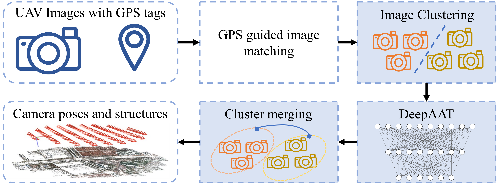

# DeepAAT: Deep Automated Aerial Triangulation for Fast UAV-based mapping <br>

### [Paper](https://www.sciencedirect.com/science/article/pii/S1569843224005466) | [arXiv](https://arxiv.org/abs/2402.01134)
<p align="center">
  
</p>

This is the implementation of the DeepAAT architecture, presented in our JAG paper <a href="https://www.sciencedirect.com/science/article/pii/S1569843224005466">DeepAAT: Deep Automated Aerial Triangulation for Fast UAV-based Mapping</a>. The codebase is forked from the implementation of the ICCV 2021 paper [Deep Permutation Equivariant Structure from Motion](https://openaccess.thecvf.com/content/ICCV2021/html/Moran_Deep_Permutation_Equivariant_Structure_From_Motion_ICCV_2021_paper.html), available at  [https://github.com/drormoran/Equivariant-SFM](https://github.com/drormoran/Equivariant-SFM). That architecture is also used as a baseline and referred to as ESFM in our paper.

DeepAAT considers both spatial and spectral characteristics of imagery, enhancing its capability to resolve erroneous matching pairs and accurately predict image poses. DeepAAT marks a significant leap in AAT's efficiency, ensuring thorough scene coverage and precision. Its processing speed outpaces incremental AAT methods by hundreds of times and global AAT methods by tens of times while maintaining a comparable level of reconstruction accuracy. Additionally, DeepAAT's scene clustering and merging strategy facilitate rapid localization and pose determination for large-scale UAV images, even under constrained computing resources. The experimental results demonstrate DeepAAT's substantial improvements over conventional AAT methods, highlighting its potential in the efficiency and accuracy of UAV-based 3D reconstruction tasks.


## Contents

- [Setup](#Setup)
- [Usage](#Usage)
- [Citation](#Citation)

---

## Setup
This repository is implemented with python 3.8, and in order to run bundle adjustment requires linux. We have used Ubuntu 22.04. You should also have a CUDA-capable GPU.

## Directory structure
The repository should contain the following directories:
```
DeepAAT
├── bundle_adjustment
├── code
├── scripts
├── environment.yml
```

## Conda environment
Create the environment using the following commands:
```
conda env create -f environment.yml
conda activate deepaat
```

## PyCeres
Next follow the <a href="bundle_adjustment/README.md">bundle adjustment instructions</a>.

## Data and pretrained models
Attached to [this](https://www.dropbox.com/scl/fo/gtju43lxu9zgn36ft86ly/AArhmE-Q2QxlmGwwvWUiyKc?rlkey=4lse57283dskw1mfy6oii3ti5&st=ky4qc4nk&dl=0). You can find both the datasets and pretrained models for Euclidean reconstruction of novel scenes.
Download the data and pretrained model, and then modify the path in the conf file accordingly. Due to the large amount of training data, only pretrained models and test data are provided.

## Usage
To execute the code, first navigate to the `code` subdirectory. Also make sure that the conda environment is activated.

To train a model from scratch for reconstruction of novel test scenes, run (Please make sure to modify the corresponding data path and configuration in the conf file correctly):
```
python multiple_scenes_learning.py --conf path/to/conf
```
where `path/to/conf` is relative to `code/confs/`, and may e.g. be `training.conf` for training a Euclidean reconstruction model using data augmentation.

The training phase is succeeded by bundle adjustment, evaluation, and by default also by separate fine-tuning of the model parameters on every test scene.

To infer a new scene, run (Please make sure to modify the corresponding data path and configuration in the conf file correctly):
```
python inference.py --conf inference.conf
```

## Citation
If you find this work useful, please cite our paper:
```
@article{chen2024deepaat,
  title={DeepAAT: Deep Automated Aerial Triangulation for Fast UAV-based Mapping},
  author={Chen, Zequan and Li, Jianping and Li, Qusheng and Dong, Zhen and Yang, Bisheng},
  journal={International Journal of Applied Earth Observation and Geoinformation},
  volume={134},
  pages={104190},
  year={2024},
  publisher={Elsevier}
}
```

## Acknowledgement
We make improvements based on [ESFM](https://github.com/drormoran/Equivariant-SFM). We thank the authors for releasing the source code.